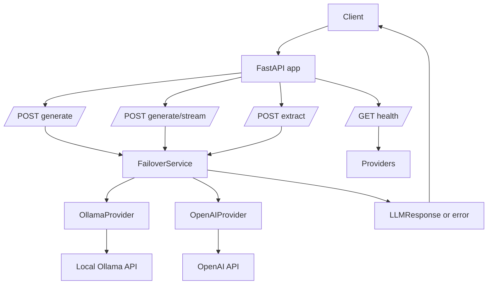
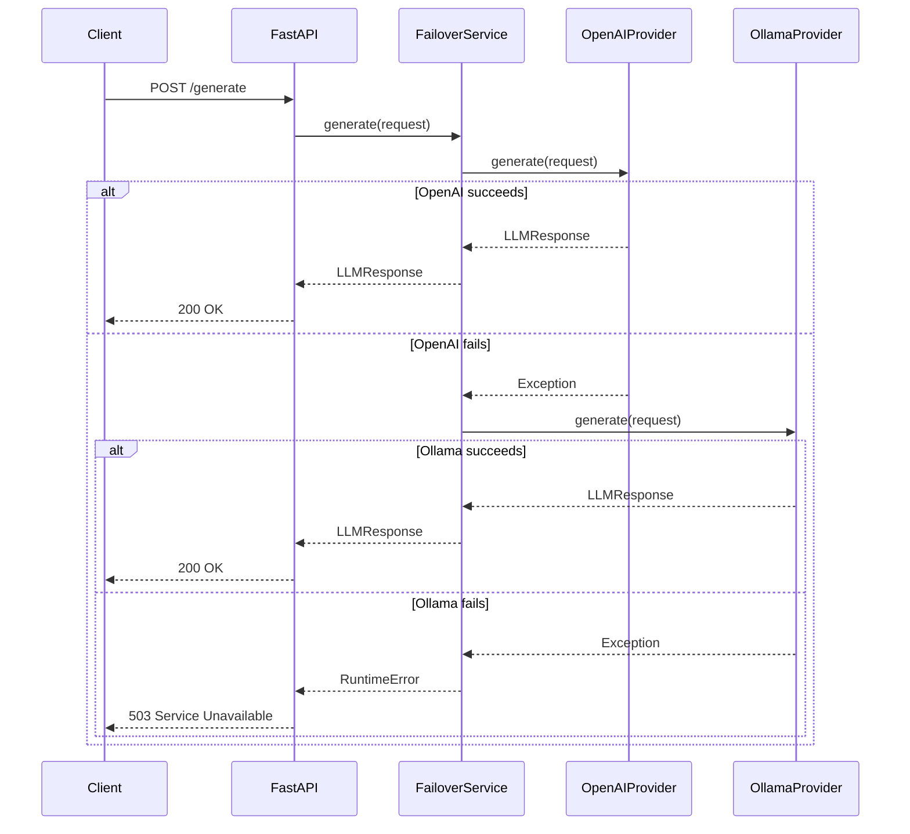

# Architecture

## Overview

This project is a small FastAPI service that exposes a unified API for multiple LLM providers.
It currently supports:

- `ollama` for local inference
- `openai` for hosted inference

The service uses a simple ordered failover strategy:

1. providers are configured in a list
2. requests are attempted in that order
3. if one provider raises an error, the next provider is tried
4. if all providers fail, the API returns an error

In the current application wiring, `OpenAIProvider` is configured before `OllamaProvider`, so the default runtime behavior is to use OpenAI first and only use Ollama if OpenAI fails.

## Diagram



## Failover Sequence



## High-Level Components

### API Layer

File: [`app/main.py`](../app/main.py)

Responsibilities:

- defines FastAPI routes
- creates provider instances
- creates the failover service
- maps internal runtime errors to HTTP responses

Endpoints:

- `GET /health`
- `POST /generate`
- `POST /generate/stream`
- `POST /extract`

### Provider Interface

File: [`app/base_provider.py`](../app/base_provider.py)

`BaseLLMProvider` defines the contract each provider must implement:

- `generate()`
- `generate_stream()`
- `health_check()`
- `get_model()`

This keeps the failover service provider-agnostic.

### Failover Service

File: [`app/failover_service.py`](../app/failover_service.py)

`FailoverService` is the orchestration layer.

Responsibilities:

- iterates through providers in configured order
- returns the first successful response
- records basic health state in `_health_cache`
- exposes both non-streaming and streaming generation paths

Important behavior:

- provider order matters
- the service does not currently do retries, backoff, or circuit breaking
- `_health_cache` is updated on explicit health refreshes and on provider failures, but generation still loops over `self.providers`

### Concrete Providers

Files:

- [`app/ollama_provider.py`](../app/ollama_provider.py)
- [`app/openai_provider.py`](../app/openai_provider.py)

#### OllamaProvider

Responsibilities:

- sends chat requests to the local Ollama HTTP API
- supports standard and streaming generation
- checks health via `/api/tags`

Key defaults:

- host: `http://localhost:11434`
- model: `qwen2.5:0.5b`

#### OpenAIProvider

Responsibilities:

- reads `OPENAI_API_KEY`
- creates an `AsyncOpenAI` client if a real key is present
- supports standard and streaming generation
- checks health by listing models

Important note:

- `.env` is loaded during provider initialization
- if the key is missing, the provider stays disabled and raises `RuntimeError("OpenAI API key not configured")` when used

### Shared Models

File: [`app/models.py`](../app/models.py)

Pydantic models define the request/response contract:

- `Message`
- `LLMRequest`
- `LLMResponse`
- `ProviderStatus`

These models are shared between the API layer, failover logic, providers, and tests.

### Registry

File: [`app/registry.py`](../app/registry.py)

`ProviderRegistry` supports registering providers dynamically and building a `FailoverService`.

At the moment, the main app creates providers directly in `app.main`, so the registry is available for future extension but is not the primary runtime path.

## Request Flows

### `POST /generate`

1. FastAPI receives an `LLMRequest`
2. `app.main.generate()` forwards it to `FailoverService.generate()`
3. the failover service tries each provider in order
4. the first successful `LLMResponse` is returned
5. if all providers fail, FastAPI returns HTTP `503`

### `POST /generate/stream`

1. FastAPI receives an `LLMRequest`
2. `app.main.generate_stream()` creates a streaming event generator
3. the failover service tries provider streaming in order
4. chunks are emitted as server-sent events
5. if a provider fails during setup, the next provider is attempted

### `POST /extract`

1. FastAPI receives plain input text
2. the endpoint builds a structured extraction prompt
3. that prompt is sent through the same failover generation path
4. the response is parsed as JSON
5. markdown code fences are stripped if present
6. invalid JSON returns HTTP `422`

## Runtime Wiring

Current wiring in [`app/main.py`](../app/main.py):

```python
ollama_provider = OllamaProvider()
openai_provider = OpenAIProvider()
failover_service = FailoverService([openai_provider, ollama_provider])
```

This means:

- OpenAI is the primary provider
- Ollama is fallback
- changing provider priority is as simple as changing the list order

## Design Tradeoffs

### Strengths

- small and easy to understand
- provider abstraction is clear
- failover behavior is deterministic
- easy to add another provider implementation
- test suite covers unit and API behavior

### Current Limitations

- provider configuration is created at import time
- no dependency injection container
- no per-request provider selection
- no retry policy or timeout policy beyond provider client defaults
- no persistence, queueing, or telemetry backend
- no circuit breaker or adaptive routing

## Extension Points

Good next evolutions if the project grows:

- move provider configuration into settings
- support explicit provider preference per request
- add retries and exponential backoff
- add request/response metrics
- add structured logging and tracing
- use the registry as the primary provider wiring path
- separate API schemas from internal domain models if the service gets larger

## Testing Strategy

Current test coverage includes:

- failover service behavior
- provider initialization and request behavior
- API endpoint behavior for `/health`, `/generate`, and `/extract`

Relevant files:

- [`tests/test_failover_service.py`](../tests/test_failover_service.py)
- [`tests/test_openai_provider.py`](../tests/test_openai_provider.py)
- [`tests/test_ollama_provider.py`](../tests/test_ollama_provider.py)
- [`tests/test_main.py`](../tests/test_main.py)
